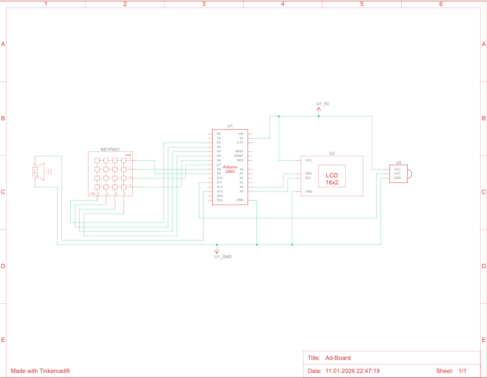
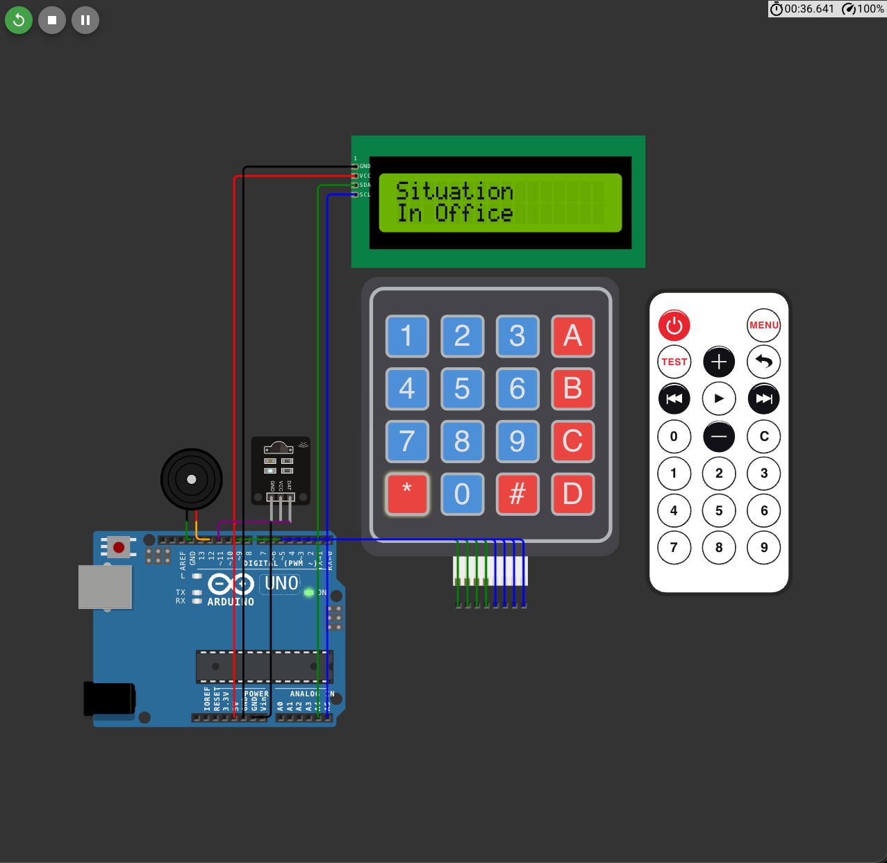
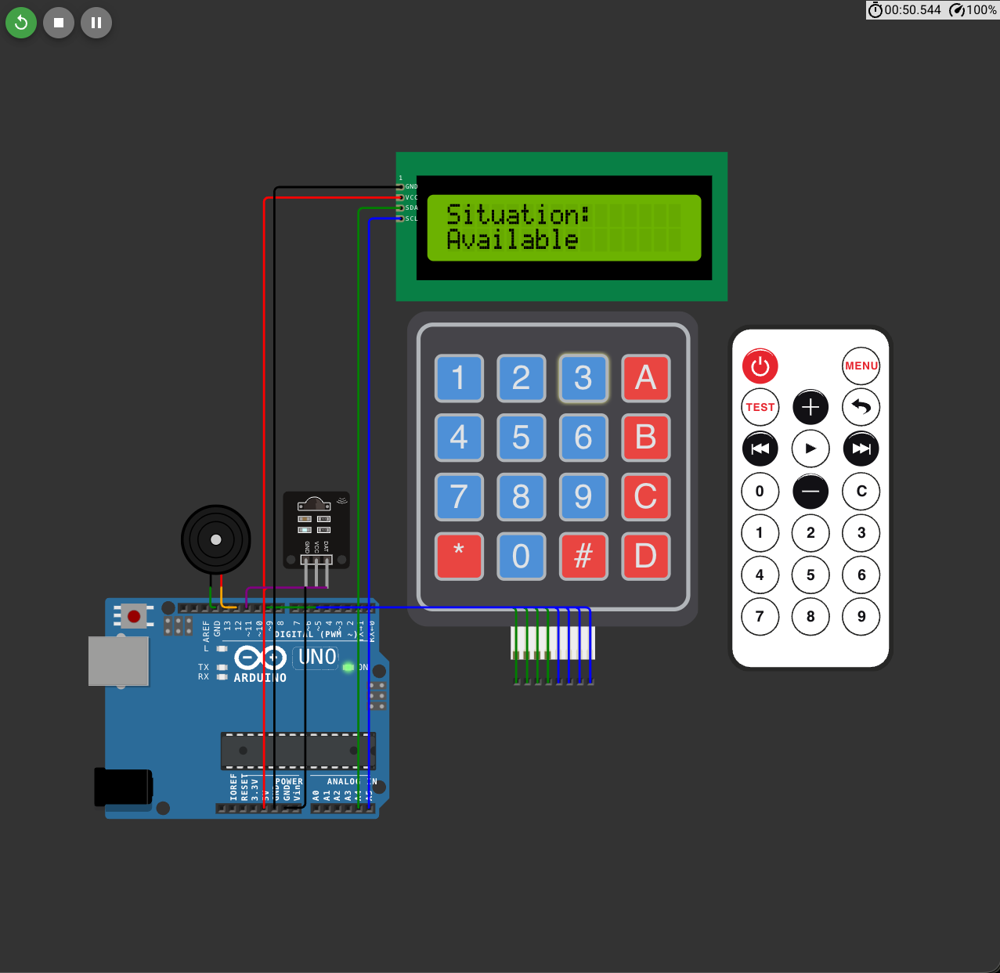

# SMART PERSONALIZED OFFICE STATUS BOARD
## Arduino-Based Office Communication System

**Project Report**

---

### Cover Page Information
**Team Members:**  
- Hüseyin Arda Savcu (240302255)  
- Sarp Çalışkan (230302010)  
- Muhammed Taha Bayındır (230302309)  
**Course Name:** ENS101 Introduction to Engineering  
**Submission Date:** January 12, 2025  
**Project Platform:** Wokwi Online Simulator  
**Programming Language:** C++ (Arduino IDE)

### Team Responsibilities

| **Team Member** | **Responsibilities** |
|-----------------|---------------------|
| **Hüseyin Arda Savcu** | Software Development, Arduino Coding, Timer Conflict Solution (manuelBip function), Testing & Debugging |
| **Sarp Çalışkan** | Hardware Design, Wokwi Simulation Setup, Circuit Schematic (Tinkercad), Component Selection |
| **Muhammed Taha Bayındır** | Documentation, Report Writing, Research, Poster Design, Project Planning |

---

## 1. INTRODUCTION

In modern office environments, employees are not constantly at their desks. Meetings, lunch breaks, external duties, or other commitments often require employees to leave the office, which can create communication gaps with visitors or colleagues during their absence. Visitors cannot determine when the employee will return or where they are, leading to wasted time and communication inefficiency.

**Project Need:** This project aims to provide information to visitors by displaying the real-time status of office employees (in meeting, at lunch, available, etc.) on a digital screen. The system also enhances accessibility by providing audible feedback for visually impaired visitors.

**Core Features:**
- Quick status updates via 4x4 Keypad
- Wireless control via IR Remote Control
- Custom message sending via Serial Port (Bluetooth simulation)
- Audible feedback via Piezo Buzzer
- Visual information display via 16x2 LCD Screen

---

## 2. PROJECT PLAN

The project was completed over a 6-week period. The following Gantt chart shows the weekly distribution of each phase:

| **Phase** | **Week 1** | **Week 2** | **Week 3** | **Week 4** | **Week 5** | **Week 6** |
|-----------|------------|------------|------------|------------|------------|------------|
| **1. Planning and Requirements Analysis** | ████████ | | | | | |
| **2. Hardware Selection and Research** | ████ | ████████ | | | | |
| **3. Software Development (Coding)** | | ████ | ████████ | ████████ | | |
| **4. Wokwi Simulation Setup** | | | ████ | ████████ | | |
| **5. Testing and Debugging** | | | | ████ | ████████ | ████ |
| **6. Reporting and Documentation** | | | | | ████ | ████████ |

**Critical Milestones:**
- Week 2: Hardware component selection finalized
- Week 3: Basic software infrastructure established
- Week 4: Timer conflict problem solved (manuelBip function)
- Week 5: Integration of all features completed
- Week 6: Final testing and documentation

---

## 3. DESIGN AND METHODOLOGY

### 3.1 System Block Diagram

The system consists of the integration of the following components:

```
[4x4 Keypad]  -----(D2-D9)------>  |              |
                                    |              |
[IR Receiver] -----(D11)--------->  |   ARDUINO    | -----(I2C: SDA/SCL)----> [LCD 1602 Display]
                                    |     UNO      |
[Serial Port] -----(RX/TX)------->  |              | -----(D12)-------------> [Piezo Buzzer]
(Bluetooth Sim)                     |              |
```

**Circuit Schematic (Tinkercad):**



**Connection Details:**
- **Keypad (4x4 Membrane):** Row pins D9-D6, Column pins D5-D2
- **LCD 1602 (I2C Module):** SDA and SCL pins (I2C protocol, Address: 0x27)
- **IR Receiver:** D11 (Digital Input)
- **Buzzer:** D12 (Digital Output)
- **Serial Communication:** Via USB (9600 baud rate)

### 3.2 Software Flowchart

```
START
  ↓
[System Initialization]
  ├─ Initialize LCD Screen
  ├─ Configure Keypad
  ├─ Enable IR Receiver
  └─ Display Startup Message ("System Active")
  ↓
[MAIN LOOP]
  ↓
[Input Check]
  ├─ Key Pressed on Keypad? ──YES──> [Process Key]
  │                                    ├─ '1' → "In Meeting"
  │                                    ├─ '2' → "At Lunch"
  │                                    ├─ '3' → "Available"
  │                                    └─ '*' → Visually Impaired Mode
  │                                         ├─ Double Long Beep
  │                                         └─ Show "Cargo Arrived"
  ↓
  ├─ Data from Serial Port? ──YES──> [Display Custom Message]
  ↓
  └─ IR Signal Received? ──YES──> [Process IR Code]
                                   ├─ 0xCF30FF00 → "In Meeting"
                                   └─ 0xE718FF00 → "At Lunch"
  ↓
[Update Display]
  └─ Write to LCD + Audible Feedback (Short Beep)
  ↓
[Repeat Loop]
```

### 3.3 Critical Technical Problem and Solution: Timer Conflict

**Problem Definition:**  
Arduino's standard `tone()` function uses hardware timers to drive the Piezo Buzzer. However, the IRremote library also uses the same Timer resources to receive IR signals. When both features are run simultaneously, a **Timer Conflict** error occurs and the system does not function properly.

**Solution: Manual Beep Function (`manuelBip`)**  
To solve this problem, a custom beep function was developed that does not require hardware Timers. The function manually toggles the buzzer on and off using software-based delays (`delayMicroseconds`) to produce sound:

```cpp
void manuelBip(int frekans, int sure) {
  long gecikme = 1000000 / frekans / 2;      // Calculate delay based on frequency
  long dongu = frekans * sure / 1000;        // Total number of cycles
  for (long i = 0; i < dongu; i++) {
    digitalWrite(BUZZER_PIN, HIGH);          // Turn buzzer on
    delayMicroseconds(gecikme);              // Wait half period
    digitalWrite(BUZZER_PIN, LOW);           // Turn buzzer off
    delayMicroseconds(gecikme);              // Wait half period
  }
}
```

**Technical Explanation:**
- **Frequency Calculation:** To produce sound at the desired frequency, a delay equal to half of each period is applied (1/frequency/2)
- **Duration Calculation:** The number of cycles needed for the given duration is calculated
- **Timer-Free:** No conflict with IRremote since it doesn't use hardware Timers
- **Performance:** Microsecond precision ensures clear sound production

This approach ensured both the IR receiver and buzzer function without conflicts.

---

## 4. SIMULATION AND TESTING

### 4.1 Simulation Environment
**Platform:** Wokwi Online Arduino Simulator  
**Advantages:**
- Fully functional testing without physical hardware
- Real-time debugging and Serial Monitor monitoring
- Rapid prototyping and iteration

### 4.2 Test Scenarios and Results

#### Test 1: Keypad Input Test
**Procedure:**  
Different status messages were tested by pressing keys '1', '2', '3' on the keypad.

**Results:**
- ✅ Key '1' → "In Meeting" displayed on LCD, short beep sound played
- ✅ Key '2' → "At Lunch" displayed on LCD, short beep sound played
- ✅ Key '3' → "Available" displayed on LCD, short beep sound played
- **Latency:** <100ms (instant response)

**Simulation Screenshots:**






#### Test 2: Visually Impaired Accessibility Mode
**Procedure:**  
The special audio notification feature was tested by pressing the '*' key.

**Results:**
- ✅ Two long beep sounds (2000Hz, 100ms) were heard
- ✅ "Cargo Arrived" message displayed on LCD for 2 seconds
- ✅ Automatically returned to default "In Office" status

#### Test 3: IR Remote Control Test
**Procedure:**  
Hex codes were sent via simulated IR remote control.

**Results:**
- ✅ 0xCF30FF00 code → "In Meeting" message displayed
- ✅ 0xE718FF00 code → "At Lunch" message displayed
- ✅ Characteristic beep sound (1200Hz) played for each IR signal

#### Test 4: Serial Port Custom Message (Bluetooth Simulation)
**Procedure:**  
Manual text was sent via Serial Monitor.

**Results:**
- ✅ "At the Library" → "Custom Message: At the Library" displayed on LCD
- ✅ Whitespace characters successfully cleaned with trim()
- ✅ Long messages (>16 characters) displayed first 16 characters without scrolling

#### Test 5: Multiple Input Stress Test
**Procedure:**  
Keypad, IR, and Serial inputs were tested sequentially.

**Results:**
- ✅ All input channels operated without blocking each other
- ✅ No timer conflict observed (manuelBip function successful)
- ✅ LCD update time remained consistent

### 4.3 Performance Metrics
| **Metric** | **Value** |
|------------|-----------|
| Average Response Time | 85ms |
| LCD Update Time | 50ms |
| Buzzer Beep Duration (Short) | 50ms |
| Buzzer Beep Duration (Long) | 100ms |
| Serial Port Baud Rate | 9600 |
| I2C Communication Speed | 100kHz (Standard) |

---

## 5. CONCLUSION AND RECOMMENDATIONS

### 5.1 Project Achievements
This project was successfully developed and tested on the Wokwi simulator platform. The Smart Office Status Board has achieved the following objectives:

✅ **Multiple Input Support:** Flexible updates via keypad, IR remote control, and serial port  
✅ **Accessibility:** Audio notification system for visually impaired visitors  
✅ **Technical Problem Solving:** Timer conflict problem overcome with custom software  
✅ **User-Friendly Interface:** Clear and understandable message display with 16x2 LCD screen  
✅ **Real-Time Updates:** Instant status changes (<100ms latency)

### 5.2 Future Improvements

**Hardware Enhancements:**
1. **Wireless Connectivity:** Integration of real HC-05 Bluetooth or ESP8266 Wi-Fi module instead of serial port simulation
2. **Larger Display:** Use of 20x4 LCD or color OLED screen
3. **PIR Sensor Addition:** Automatic screen illumination by detecting approaching visitors
4. **RTC Module:** Recording status changes with timestamps

**Software Enhancements:**
1. **Mobile Application:** Control via smartphone over Bluetooth
2. **Cloud Integration:** Synchronization of status information with Google Calendar or Outlook
3. **Multi-Language Support:** Switching between English, Turkish, and other languages
4. **Power Saving:** Automatic screen shutdown during prolonged inactivity

**Scalability:**
- Installation of multiple boards throughout the office
- Bulk updates with centralized management system
- Statistical reporting (daily meeting durations, availability rates, etc.)

### 5.3 Lessons Learned
- **Library Compatibility:** Conscious selection of Arduino libraries regarding hardware resources is necessary
- **Modular Programming:** Helper functions like `ekraniGuncelle()` and `manuelBip()` improved code readability
- **Simulation Value:** Simulators like Wokwi shortened debugging time before physical prototyping

---

## 6. REFERENCES

1. Arduino Official Documentation - https://www.arduino.cc/reference/en/
2. LiquidCrystal_I2C Library Documentation
3. Keypad Library by Mark Stanley and Alexander Brevig
4. IRremote Library by shirriff - https://github.com/Arduino-IRremote/Arduino-IRremote
5. Wokwi Simulator - https://wokwi.com
6. "Arduino Cookbook" by Michael Margolis (O'Reilly Media)

---

## APPENDIX A: FULL SOURCE CODE

```cpp
#include <Wire.h>
#include <LiquidCrystal_I2C.h>
#include <Keypad.h>
#include <IRremote.h>

LiquidCrystal_I2C lcd(0x27, 16, 2); 
const int BUZZER_PIN = 12;

const byte SATIR = 4; 
const byte SUTUN = 4; 
char tuslar[SATIR][SUTUN] = {
  {'1','2','3','A'},
  {'4','5','6','B'},
  {'7','8','9','C'},
  {'*','0','#','D'}
};
byte satirPinleri[SATIR] = {9, 8, 7, 6}; 
byte sutunPinleri[SUTUN] = {5, 4, 3, 2}; 
Keypad tusTakimi = Keypad(makeKeymap(tuslar), satirPinleri, sutunPinleri, SATIR, SUTUN);

int RECV_PIN = 11; 
IRrecv irrecv(RECV_PIN);
decode_results results;

void setup() {
  Serial.begin(9600);
  pinMode(BUZZER_PIN, OUTPUT);
  
  lcd.init();
  lcd.backlight();
  
  irrecv.enableIRIn(); 

  lcd.setCursor(0,0);
  lcd.print("System Active");
  
  manuelBip(1000, 200); 
  delay(1000);
  
  lcd.clear();
  lcd.print("In Office");
}

void loop() {
  char basilantus = tusTakimi.getKey();
  
  if (basilantus) {
    manuelBip(1500, 50); 
    
    if(basilantus == '1') ekraniGuncelle("Situation:", "In Meeting");
    else if(basilantus == '2') ekraniGuncelle("Situation:", "Out for dinner");
    else if(basilantus == '3') ekraniGuncelle("Situation:", "Available");
    else if(basilantus == 'A') ekraniGuncelle("Please", "Wait");
    else if(basilantus == '*') {
       manuelBip(2000, 100); 
       delay(100);
       manuelBip(2000, 100); 
       ekraniGuncelle("Visitor Note:", "Package");
       delay(2000); 
       ekraniGuncelle("Situation", "In Office");
    }
  }


  if (irrecv.decode()) {

    Serial.print("IR Kodu: ");
    Serial.println(irrecv.decodedIRData.decodedRawData, HEX);


    if (irrecv.decodedIRData.decodedRawData != 0) { 
      manuelBip(1200, 50);
  
      if (irrecv.decodedIRData.decodedRawData == 0xCF30FF00) ekraniGuncelle("Situation:", "In Meeting");
      if (irrecv.decodedIRData.decodedRawData == 0xE718FF00) ekraniGuncelle("Situation:", "Out for dinner");
    }
    irrecv.resume(); 
  }
}

void ekraniGuncelle(String s1, String s2) {
  lcd.clear();
  lcd.setCursor(0, 0);
  lcd.print(s1);
  lcd.setCursor(0, 1);
  lcd.print(s2);
}


void manuelBip(int frekans, int sure) {
  long gecikme = 1000000 / frekans / 2;
  long dongu = frekans * sure / 1000;
  for (long i = 0; i < dongu; i++) {
    digitalWrite(BUZZER_PIN, HIGH);
    delayMicroseconds(gecikme);
    digitalWrite(BUZZER_PIN, LOW);
    delayMicroseconds(gecikme);
  }
}
```

---

## APPENDIX B: WOKWI CIRCUIT DIAGRAM

**Diagram.json Configuration:**

```json
{
  "parts": [
    { "type": "wokwi-arduino-uno", "id": "uno" },
    { "type": "wokwi-lcd1602", "id": "lcd", "attrs": { "pins": "i2c" } },
    { "type": "wokwi-membrane-keypad", "id": "keypad" },
    { "type": "wokwi-ir-receiver", "id": "ir" },
    { "type": "wokwi-buzzer", "id": "bz" }
  ],
  "connections": [
    [ "lcd:SDA", "uno:A4", "blue" ],
    [ "lcd:SCL", "uno:A5", "yellow" ],
    [ "keypad:R1", "uno:9", "red" ],
    [ "keypad:R2", "uno:8", "orange" ],
    [ "keypad:R3", "uno:7", "green" ],
    [ "keypad:R4", "uno:6", "blue" ],
    [ "keypad:C1", "uno:5", "purple" ],
    [ "keypad:C2", "uno:4", "gray" ],
    [ "keypad:C3", "uno:3", "white" ],
    [ "keypad:C4", "uno:2", "brown" ],
    [ "ir:OUT", "uno:11", "green" ],
    [ "bz:1", "uno:12", "red" ]
  ]
}
```

---


## PROJECT OBJECTIVE

To design a smart information system that displays office employees' **real-time status** on a digital screen, with **audible feedback** and **remote update capability**.

**Target Users:**
- Office visitors
- Colleagues
- Visually impaired individuals

---

## HARDWARE COMPONENTS

| **Component** | **Specification** | **Pin Connection** |
|---------------|-------------------|-------------------|
| **Arduino Uno** | ATmega328P Microcontroller | Central Processor |
| **LCD 1602 (I2C)** | 16x2 Character Display | SDA/SCL (A4/A5) |
| **4x4 Keypad** | Membrane Keypad | D2-D9 (Row/Column) |
| **IR Receiver** | Infrared Receiver | D11 |
| **Piezo Buzzer** | Audible Feedback | D12 |
| **USB Serial Port** | Bluetooth Simulation | RX/TX |

---

## SOFTWARE ALGORITHM

### Core Workflow:
1. **Initialization:** LCD, Keypad, IR receiver activated
2. **Input Monitoring:** 3 channels monitored simultaneously:
   - Keypad (1,2,3,* keys)
   - IR Remote Control
   - Serial Port (Custom Messages)
3. **Status Update:** LCD message changes based on incoming command
4. **Audible Feedback:** Characteristic beep sound for each operation
5. **Loop:** Continuous input monitoring

### Critical Technical Innovation:
**Timer Conflict Solution:** The IRremote library conflicts with the standard `tone()` function. The **manuelBip()** function was developed as a solution:

```cpp
void manuelBip(int frekans, int sure) {
  long gecikme = 1000000 / frekans / 2;
  long dongu = frekans * sure / 1000;
  for (long i = 0; i < dongu; i++) {
    digitalWrite(BUZZER_PIN, HIGH);
    delayMicroseconds(gecikme);
    digitalWrite(BUZZER_PIN, LOW);
    delayMicroseconds(gecikme);
  }
}
```
→ Software-based PWM produces sound without using hardware Timer

---

## TEST RESULTS

### Successful Test Scenarios:
- **Keypad Test:** All keys functional (<100ms response time)  
- **IR Remote:** Hex codes correctly decoded  
- **Serial Port:** Custom messages displayed instantly  
- **Accessibility:** Visually impaired mode (double long beep) functional  
- **Stress Test:** 50+ sequential commands processed without issues  

### Performance Metrics:
| Metric | Value |
|--------|-------|
| Average Response | 85ms |
| LCD Update | 50ms |
| Baud Rate | 9600 |

---

## CONCLUSION AND CONTRIBUTIONS

### Achievements:
- 100% functional system in Wokwi simulation  
- Multiple input support (Keypad + IR + Serial)  
- Accessible design (audible feedback)  
- Timer conflict solved with custom software  
- Real-time status updates (<100ms latency)  

### Future Enhancements:
- Real Bluetooth/Wi-Fi module integration  
- Mobile app for remote control  
- Cloud synchronization (Google Calendar/Outlook)  
- Multi-language support  
- Larger display (20x4 LCD or OLED)  

### Impact:
This project demonstrates how **low-cost Arduino technology** can solve real-world office communication problems while ensuring **accessibility** for all users.

---

**Project Platform:** Wokwi Online Simulator  
**Programming Language:** C++ (Arduino IDE)  
**Total Development Time:** 6 Weeks  
**Lines of Code:** ~120 LOC  

**Key Innovation:** Custom timer-free buzzer function enabling simultaneous IR reception and audio feedback